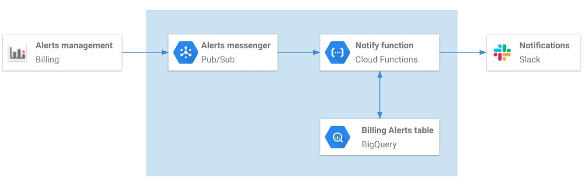

# Billing Control

THis repository contains three Google Cloud functions reltaed to billing monitoring with Slack. 
It also contains "Infrastructure as Code" in order to deploy these fucntions with only the use of a gcloud command.

### Install

1. Clone this repo on your local machine

2. Enable Deployment manager API on your project

3. Create a slack app and enable incoming webhook on it (https://api.slack.com/incoming-webhooks).

4. Install ytt library (https://k14s.io/). This is a templating library that will inject your values into the 
different configuration files.

5. Replace the values in the "values.yaml" file. Only the first three values are mandatory to be replaced.
    - billing_id: Need to be replaced with the billing id of your project
    - slack_webhook: Need to be replaced by the incoming webhook of your slack app
    - slack_channel: channel to which you want your billing alerts to be sent
    - topic_name: pub/sub topic namme. Optional to change.
    - dataset_name: BigQuery dataset where the billing alert data will be stored.
    - dataset_location: Location of the BigQuery dataset. Can be either 'US' or 'EU'
    - table_name: BigQuery table where the billing alert data will reside
    - bucket_function_name: Google Cloud storage bucket where the functions source code will be stored
    - region: Region for the GCS bucket and the functions

6. Run the following code:

    ```
    ytt -f values.yaml -f dm/ -o dm/output-dir/
    ```

7. Start with the "fn-notif-billing" function (will send you automatically billing alerts to a slack channel) 
that will deploy the resources in the blue boxes below:

    

    To deploy these resources, run the following code:

    ```
    gcloud deployment-manager deployments create billing-alert-dep \
    --config dm/output-dir/config_alert.yaml \
    --project [PROJECT ID]
    ```

8. One piece is still missing in th eprevious flow; to enable the billign alerts. You cna do this easily through the
GOogle CLodu UI (https://cloud.google.com/billing/docs/how-to/budgets). It's of major importance that you set
Cloud Pub/Sub as the sink where your alerts will be published. ANd the topic must be the one created through
Deployment Manager.

9. Deploy the second function that will send the current billing for this month once called by a user. It will be 
called through a slack slash command. TO deploy the function, run the following code:

    ```
    gcloud deployment-manager deployments create billing-alert-dep \
    --config dm/output-dir/config_current_billing.yaml \
    --project [PROJECT ID]
    ```

10. In the same app that you have created on step 3, create a slash command and insert the following values:
    - command: "/currentbilling"
    - Request URL: url that the function deployed has created. Click on the function deployed through the previous
                   step and copy/paste the url.
    - Short description: "Get the current billing for this month"
    - Save it

11. Deploy the third function that will give you the delta billing between two dates when called by a user. It will be 
called through a slack slash command. To deploy the function, run the following code:

    ```
    gcloud deployment-manager deployments create billing-alert-dep \
    --config dm/output-dir/config_delta_billing.yaml \
    --project [PROJECT ID]
    ```
    
12. In the same app that you have created on step 3, create a slash command and insert the following values:
    - command: "/diffbilling"
    - Request URL: url that the function deployed has created. Click on the function deployed through the previous
                   step and copy/paste the url.
    - Short description: "Compare the billing increase between 2 days"
    - Save it
    

You have now configured your slack as cost monitoring system for your GCP. You will now get automatic billing alerts
and give your users the possibility to interact with the billing through two slash commands. Many more slash commands
can be deployed and the workflow will remain the same as per steps 9 and 10.
    
 